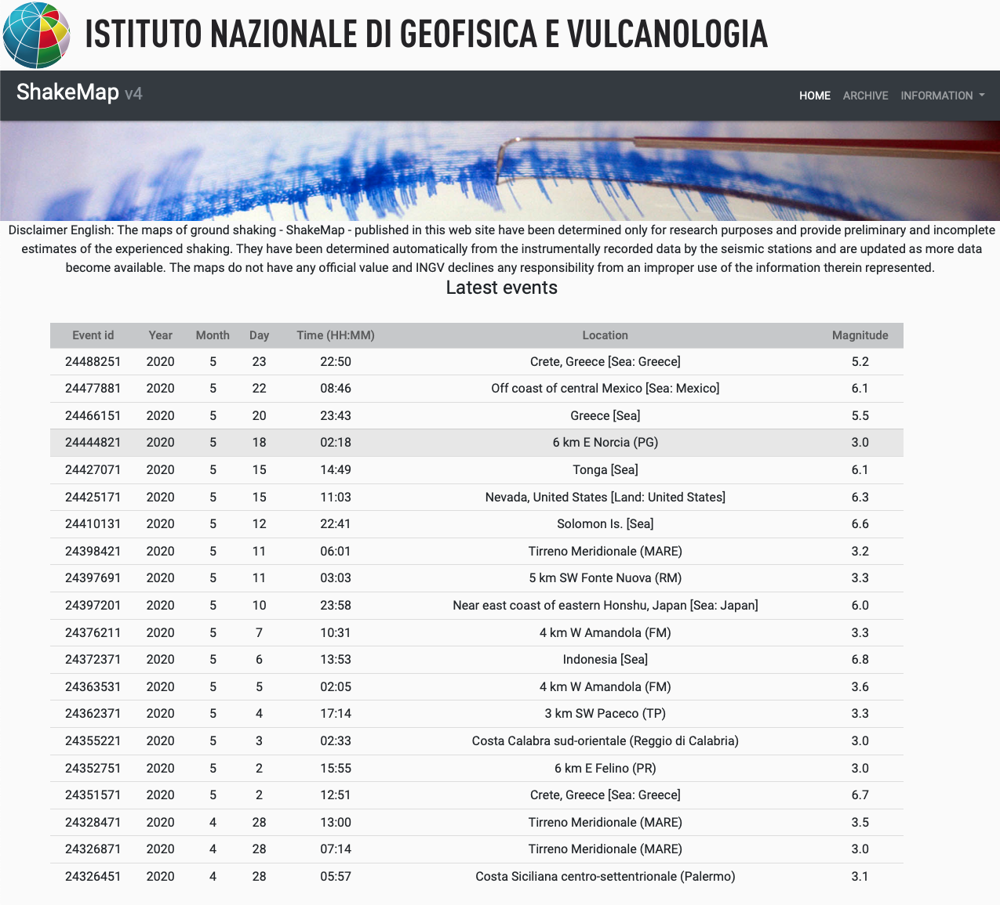
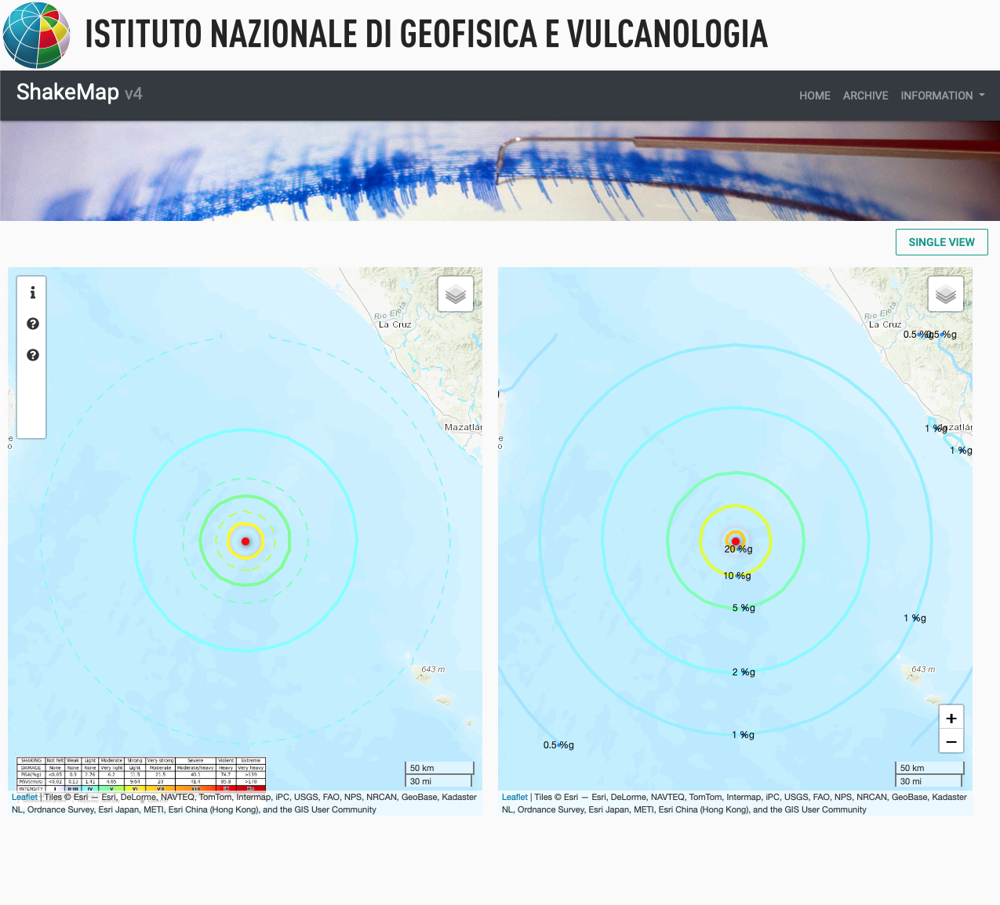

|**Service**|**Master**|**Develop**|
|---|---|---|
|CircleCI|[](https://circleci.com/gh/INGV/shakemap4-web/tree/master)|[](https://circleci.com/gh/INGV/shakemap4-web/tree/develop)|
|Version|[](https://github.com/INGV/shakemap4-web/blob/master/publiccode.yml)|[](https://github.com/INGV/shakemap4-web/blob/develop/publiccode.yml)|

[![TeamDigitale](https://img.shields.io/badge/publiccode%20compliant-%E2%9C%94-blue.svg?logo=data:image/png;base64,iVBORw0KGgoAAAANSUhEUgAAAA4AAAAOCAMAAAAolt3jAAAAIGNIUk0AAHomAACAhAAA+gAAAIDoAAB1MAAA6mAAADqYAAAXcJy6UTwAAAFxUExURQBmzABmzABmzABkywBkywBmzABmzABmzApszj2L2CyA1QBmzABmzABmzABlzABkywBlzABmzABkywBkywBkyyZ91OXv+qTH7AJlzABlzABmzABlzBJx0Hiu5EyU2wBmzECM2Wil4RRy0CZ91Orz+8/i9W2n4h950gBlzABkyzuJ2Pb6/bbT8AVpzZbA6vX5/TOE1iR80+jx+vn8/uXv+kKO2QBjywBlzA9vz3Cp4kmS2wBlzJbA6vX5/TOE1uvz+7LR8Ch+1AttzgBmzABmzABkywBkywBlzJbA6uz0+6PH7AFlzABmzABmzABlzJbA6jOE1iR70+z0+6TH7AFky5bA6jOF1hx30uPu+c/i9V+f3xl10QBlzABmzABlzIi459/s+TCD1gVpzZ7F7Pb6/evz+0CM2QBjywBmzBd00SV80whrzgBlzBFwzzqJ2DaG1wttzgBmzABmzABlzABlzABmzABmzABkywBkywBmzP///7f5b6EAAAABYktHRHo41YVqAAAAB3RJTUUH4wUWBTMYAFp7MgAAAF50RVh0UmF3IHByb2ZpbGUgdHlwZSBpcHRjAAppcHRjCiAgICAgIDI4CjM4NDI0OTRkMDQwNDAwMDAwMDAwMDAwZjFjMDI2ZTAwMDM1MjQ2NDcxYzAyMDAwMDAyMDAwNDAwCmCaPZ4AAAClSURBVAjXY2DAChiZmFlYwSw2EMHOwcnFzcPAwMvHLyAoJCwiKiYuISnFIC0jKyevoKikrKKqpq7BoKmlraOrp29gaGRsYmrGYG5haWVtY2tnaO/g6OTMwOvi6ubuAeR6enn7+IJMZfXztw0IDAoOkZaCcEP1w8IjIqOiY0Dc2Lj4hMSk5JTUtHSwOzIys7JzcvPyCwrB7ioqLiktMy+vqPRFczoAaG4fQ5lQVPsAAAAldEVYdGRhdGU6Y3JlYXRlADIwMTktMDUtMjJUMDU6NTE6MjQtMDQ6MDDV7wZaAAAAJXRFWHRkYXRlOm1vZGlmeQAyMDE5LTA1LTIyVDA1OjUxOjI0LTA0OjAwpLK+5gAAAABJRU5ErkJggg==)](https://developers.italia.it/it/software/ingv-ingv-shakemap4-web)

[](https://github.com/INGV/shakemap4-web/blob/master/LICENSE)
[](https://github.com/INGV/shakemap4-web/issues)

# shakemap4-web

The development presented in this project is aimed towards providing a simple web interface to show the products of the USGS ShakeMap v. 4 software (http://usgs.github.io/shakemap/sm4_index.html). The web interface renders the standard products provided by ShakeMap dynamically (using leafelet https://github.com/Leaflet/Leaflet) and statically (standard shakemaps).   
The apperance of the web portal is easily configurable by replacing the logo and banners. The software can be installed both laptops and on server computers.

## Installation
```
$ git clone https://github.com/INGV/shakemap4-web
$ cd shakemap4-web
```

## Configure
Copy docker environment file:
```
$ cp ./Docker/env-example ./Docker/.env
```
### Set NGINX port
Set `NGINX_HOST_HTTP_PORT` in `./Docker/.env` file (default port is `8091`).

### Set 'data' path
Set `SHAKEMAP_DATA_PATH` with the absolute `data` path; ie: `/home/shake/shakemap4/shakemap_profiles/world/data`

### !!! On Linux machine and no 'root' user !!!
To run containers as *linux-user* (intead of `root`), set `WORKSPACE_PUID` and `WORKSPACE_PGID` in `./Docker/.env` file with:
- `WORKSPACE_PUID` should be equal to the output of `id -u` command
- `WORKSPACE_PGID` should be equal to the output of `id -g` command

## Start shakemap4-web
First, build docker images:

```
$ cd Docker
$ docker-compose up -d
$ cd ..
```

## How to use it
When all containers are started, connect to:
- http://<your_host>:<your_port>/

default is:
- http://localhost:8091

If all works, you should see ShakeMap4-Web web page.

## Tips and tricks
### To change nginx port live:
1) Update `NGINX_HOST_HTTP_PORT` in `.env`
2) run:
```
$ docker-compose build nginx
```
3) Restart docker:
```
$ docker-compose up --no-deps -d nginx
```

### Rebuild an image from existing `Dockerfile` (es: workspace)
```
$ docker-compose build --no-cache workspace
```

### Rebuild an image from a remote image (es: nginx)
```
$ docker-compose pull nginx
```
### Add a banner above the menu bar

To add a banner above the menu bar (e.g. like the INGV banner that can be seen on the screenshots below), you can just uncomment the following code in all the `.html` files:
```
 <!-- <div style="width: 100%; margin: 0 auto;">
      
 </div> -->
```
 and replace the `src` attribute value with the location of your banner image. The code can be uncommented by removing the `<!--` and `-->` from the code. The banner image can be of any size.

### Example screenshot



## Thanks to
This project uses the [Laradock](https://github.com/laradock/laradock) idea to start docker containers.   
This  work has been partially funded by the Seismology and Earthquake Engineering Research Infrastructure Alliance for Europe (SERA) project (European Union’s Horizon 2020 research and innovation program Grant Agreement Number 730900) and by the Italian Civil Protection (2019–2021) B2 ShakeMap adjournment project.

## Contribute
Please, feel free to contribute.

## Author
(c) 2019 Dario Jozinovic dario.jozinovic[at]ingv.it \
(c) 2019 Valentino Lauciani valentino.lauciani[at]ingv.it


Istituto Nazionale di Geofisica e Vulcanologia, Italia
