# Contributors

## Participating Institutes

| Logo | Institute | People involved |
|------|----------|---------------------|
| 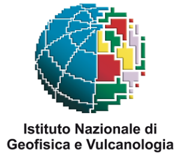 | Istituto Nazionale di Geofisica e Vulcanologia (INGV) | Licia Faenza, Ilaria Oliveti, Alberto Michelini, Valentino Lauciani |
| 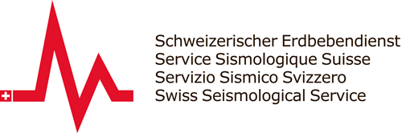 | Swiss Earthquake Observatory (SED) | Carlo Cauzzi, Philipp Kästli, John Clinton |
| 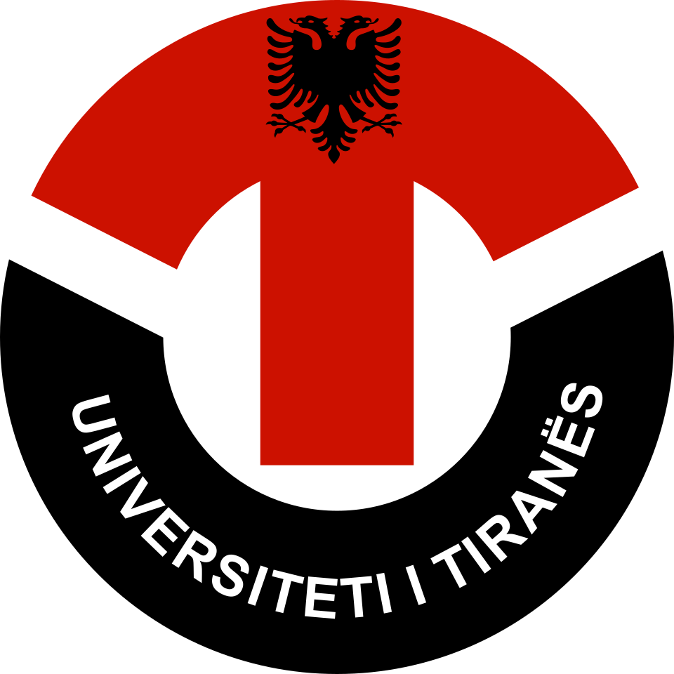 | Department of Seismology, Institute of Geosciences, Polytechnic University of Tirana | Edmond Dushi, Besian Rama |
| 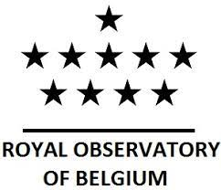 | Royal Observatory of Belgium (ROB) | Thomas Lecocq, Kris Vanneste, Koen Van Noten |
| 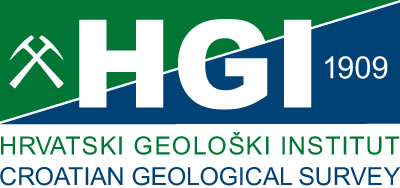 | Croatian Seismological Survey (HGI) | Krešimir Kuk |
| 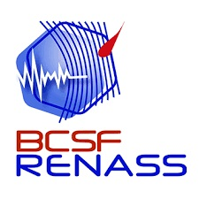 | BCSF-Rénass Epos-France | Marc Grunberg, Véronique Mendel, Antoine Schlupp, Christophe Sira |
|  | Institute of Engineering Seismology & Earthquake Engineering (ITSAK) | Kiriaki Konstantinidou, Nikolaos Theodoulidis |
| 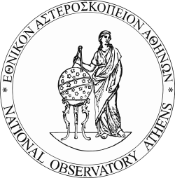 | National Observatory of Athens (NOA) | Nicos Melis |
|  | Istituto Nazionale di Oceanografia e di Geofisica Sperimentale (OGS) | Luca Moratto |
|  | Institute of Hydrometeorology and Seismology (IHMS) | Jovan Dedic, Jadranka Mihaljevic |
| 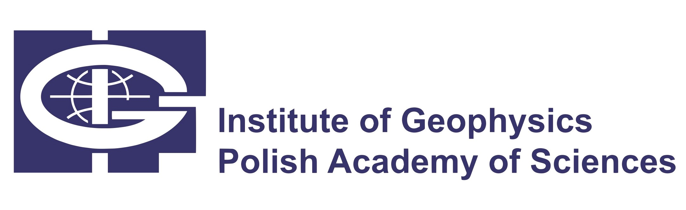 | Institute of Geophysics of the Polish Academy of Sciences | Janusz Mirek, Łukasz Rudziński |
| 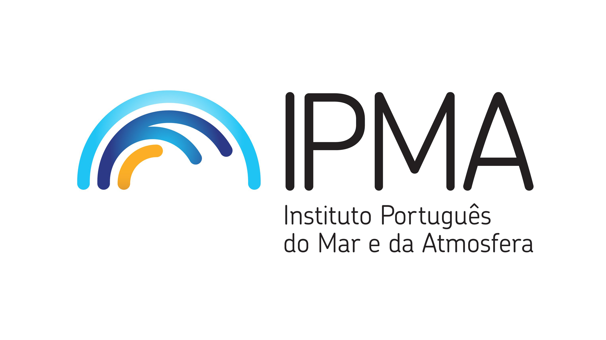 | Portuguese Institute of the Sea and Atmosphere (IPMA) | Fernando Carrilho |
| 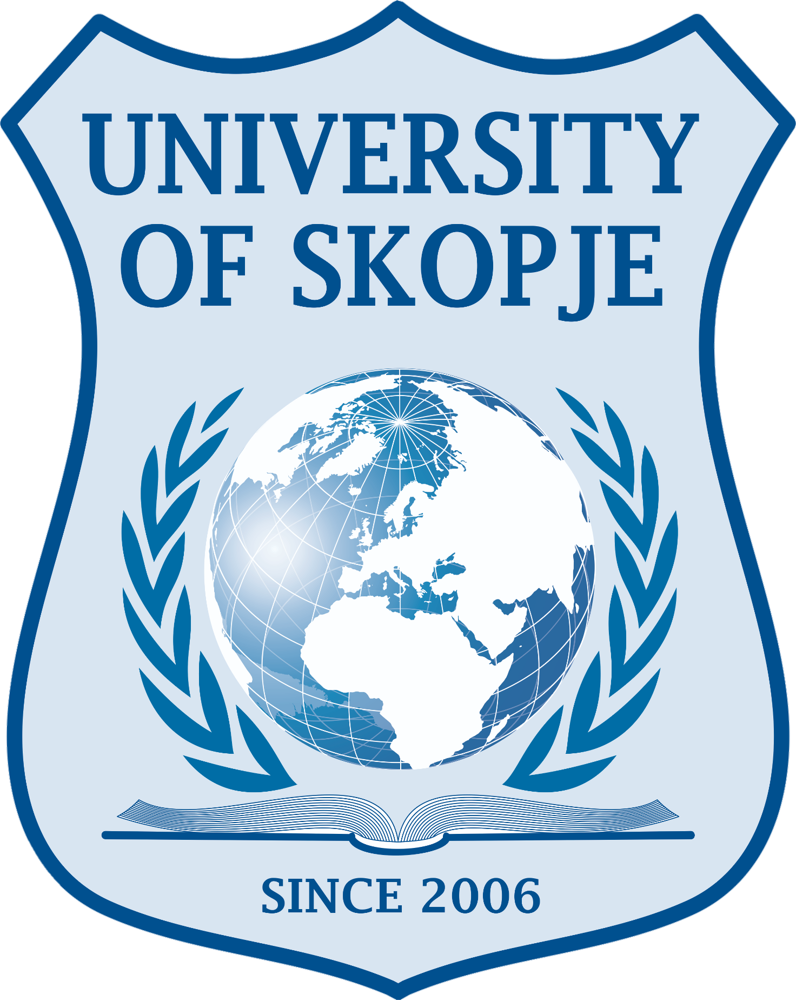 | University of Skopje | Dragana Cernih, Radmila Salic |
|  | National Institute for Earth Physics (NIEP) | Bogdan Grecu, Constantin Ionescu, Alexandru Marmureanu |
| 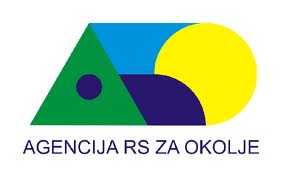 | Slovenian Environment Agency (ARSO) | Martina Čarman, Polona Zupančič |

## ShakeMap EU Support Group: Historical and Instrumental data

| Name | Institute | Nationality |
|------|----------|-------------|
| Ludmila Provost | IRSN, PSE-ENV/SCAN, Fontenay-aux-Roses Cedex | France |
| Graeme Weatherill | German Research Centre for Geosciences GFZ | Germany |
| Andrea Antonucci | Istituto Nazionale di Geofisica e Vulcanologia (INGV) | Italy |
| Mario Locati | Istituto Nazionale di Geofisica e Vulcanologia (INGV) | Italy |
| Lucia Luzi | Istituto Nazionale di Geofisica e Vulcanologia (INGV) | Italy |
| Claudia Mascandola | Istituto Nazionale di Geofisica e Vulcanologia (INGV) | Italy |
| Andrea Rovida | Istituto Nazionale di Geofisica e Vulcanologia (INGV) | Italy |
| Ina Cecic | Slovenian Environment Agency - ARSO | Slovenia |
| Maren Bose | Swiss Seismological Service SED@ETH Zurich | Switzerland |

## ShakeMap EU Scientific and Technical Advisors

| Name | Institute | Nationality |
|------|----------|-------------|
| Fabrice Cotton | German Research Centre for Geosciences GFZ | Germany |
| Domenico Giardini | Department of Earth Sciences ERDW at ETH Zurich | Switzerland |
| Stefan Wiemer | Swiss Seismological Service SED@ETH Zurich | Switzerland |
| Anastasia Kiratzi | Aristotle University of Thessaloniki and EPOS-Seismology Secretary | Greece |
| David J Wald | USGS Golden | USA |
| Eric M Thompson | USGS Golden | USA |
| C. Bruce Worden | Synergetics, Inc. contractor in support of the U.S. Geological Survey | USA |
