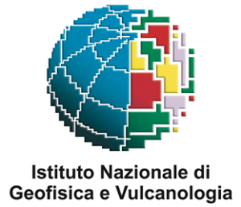
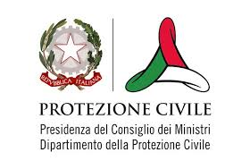
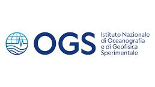
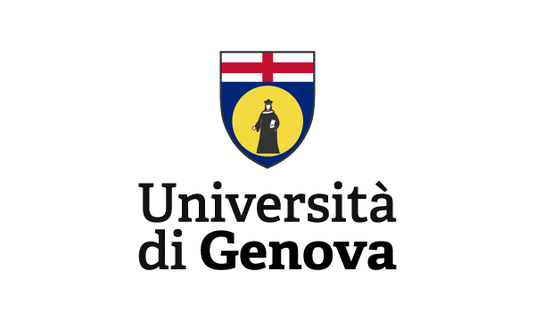
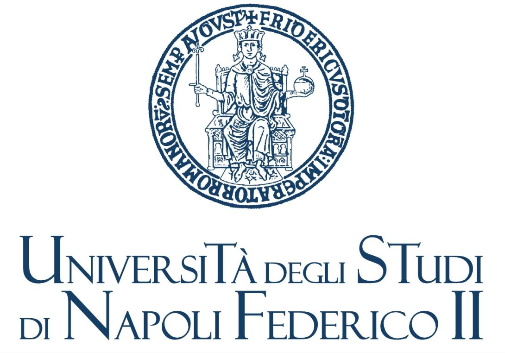
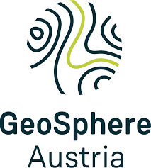
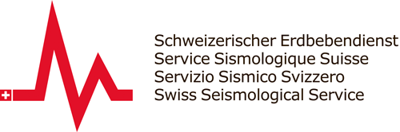
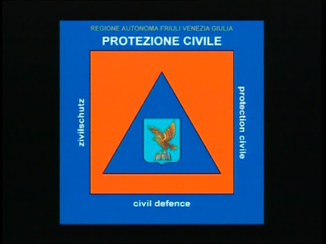

# Contributors

## DOI and Citation

*DOI and citation will be added here.*

## Participating Institutes

| Logo | Institute | Personnel involved |
|------|----------|---------------------|
|  | Istituto Nazionale di Geofisica e Vulcanologia (INGV) | Licia Faenza, Ilaria Oliveti, Alberto Michelini, Valentino Lauciani |
|  | Dipartimento della Protezione Civile (DPC) | -- |
|  | Istituto Nazionale di Oceanografia e di Geofisica Sperimentale (OGS) | -- |
|  | Università di Genova (UNIGE) | -- |
|  | Università di Trieste (UNITS) | -- |
|  | Università di Napoli Federico II (UNINA) | -- |
|  | GeoSphere (GeoSphere) | -- |
|  | Swiss Seismological Service (SED) | -- |
|  | Dipartimento della Protezione Civile - Friuli Venezia Giulia (DPC-Friuli) | -- |
